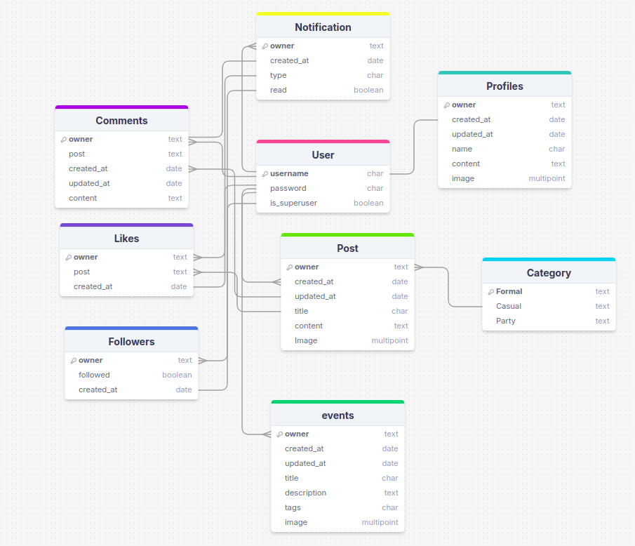
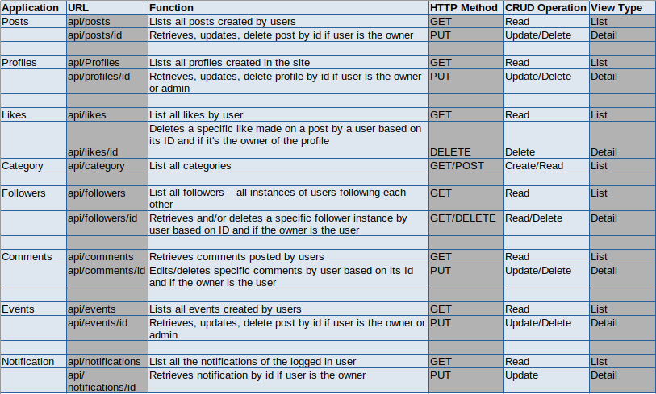

# DESIGNER HUB

Designer Hub is a website created as a social media app for Designers. Here designers can interact with each other, posts there designes, get in touch with each other. They can share their opinios and create events related to desiging issues. The API is the backend of the platfrm which gives  create, view, edit and delete posts, events, new profiles, getting notification, choosing category, follow/unfollow users. 

The live API can be found [here](https://designerhubbackend-ebd8c03488fb.herokuapp.com/)

# Agile Development

The project was created based on user stories . The user stories are given here:

* As a user I can create my own profile so that I can create my post, edit/delete it
* As a user I can create posts so that I can update my contents
* As a user I can create edit/delete my comments so that I can keep my opinion uptodate
* As a user I can like/unlike posts so that I can express my preference
* As a user I can follow/unfollow other users so that I keep in touch with the profiles I am interested in
* As a user I can search or post in different categories so that it is easier to sort out my choice
* As a user I can get notified so that I know my posts have new like, comment or I have a new follower
* As a user I can create/see events so that I can know what is happening

The detais about user stories can be found [here](https://github.com/users/farhatamannaislam/projects/6/views/1)

# Database Design

I have the following models:

* Post - My post model is customized which includes a catagory parameter. 
* Category - User can post into a specific category.
* Comments - User can comment on a post
* Like - User can like/unlike a post
* Follow - User can follow/unfollow each other.
* Notification - User gets notification if another user like, comments on their posts or follow them.
* Profiles - Created automatically with every user.

# Data model Diagram

I drew my data model schema using [DrawSQL](https://drawsql.app/).
The table is given below, along with all of the different relationships they had with each other.

My datamodel is given here 

# API Endpoints

My API endpoints is given here 

# Frameworks, libraries and dependencies

* Framework - This project was made using Django and Django Rest Framework. 
* Database -  PostgreSQL has been used for data storage.
* Authentication - Django's built in authentication systems such as dj-allauth, dj-rest-auth as well as JSON web token
* REST API endpoints  - REST API endpoints for login and logout.
* django-filter - is used for filtering.
* Cross-Origin-Resource Sharing - The django apps includes Cross-Origin-Resource Sharing (CORS) headers to enable API to
 respond to requests other than its host.
* Heroku - is used for deployment.
* Cloudinary - is used for image hosting.
* gunicorn -  is used to deploy web application.
* pillow- is used for image processing capabilities.
* django-taggit - used for tagging.

Testing

All the testing related information are found on [TESTING.md](./TESTING.md) file.

# Deployment

* We need to create a GitHub repository from the Code Institute template by following the link and then click 'Use this template'.
* We have to create new repository using 'Create Repository From Template'.
* Then we have to use pip3 install 'django<4' gunicorn, pip3 install 'dj_database_url psycopg2, pip3 install 'dj3-cloudinary-storage commands.
* After that we have to create rewuirements.txt
* Then we have to create our project and corresponding applications.
* Once the applications are finished and it runs without error we can deploy.
* After Heroku login we have to create our app.
* Then we need to to the ElephantSQL dashboard and click on the 'database instance name' for this project.
* We have to copy the ElephantSQL database URL to our clipboard .
* In the Heroku dashboard we need to select Settings tab.
* In the 'reveal config vars' we need to add the following
    CLOUDINARY_URL: cloudinary URL as obtained above
    DATABASE_URL: ElephantSQL Postgres database URL as obtained above
    SECRET_KEY: secret key
* Then we have to go to 'Deploy' tab and select 'GitHub' from the deployment options
* We need to choose 'Connect to GitHub' and find the repo using search option and then select connect.
* We have to choose 'Manual Deploy' section, 'main' branch and  'Deploy Branch'
* Then Project will be deployed.

# Credits

* Code Institute Moment Project Backend API
* [Django Rest Documentation](https://www.django-rest-framework.org/)
* [Stack Overflow](https://try.stackoverflow.co/explore-teams?utm_source=adwords&utm_medium=ppc&utm_campaign=kb_teams_search_brand_emea-dach&_bt=657236278306&_bk=stack+overflow&_bm=p&_bn=g&gad_source=1&gclid=Cj0KCQjwgL-3BhDnARIsAL6KZ6_pwoKORZsa1lTx6qiGV0lVk8z-umBVQtsd4hOOPy8zZCwGjcXPVuIaAr_0EALw_wcB)
* Code Institute Tutors and slack Community for their support, guiding and valuable information.
* My  Mentor Antonio Rodriguez for his precious guidance and advice.

