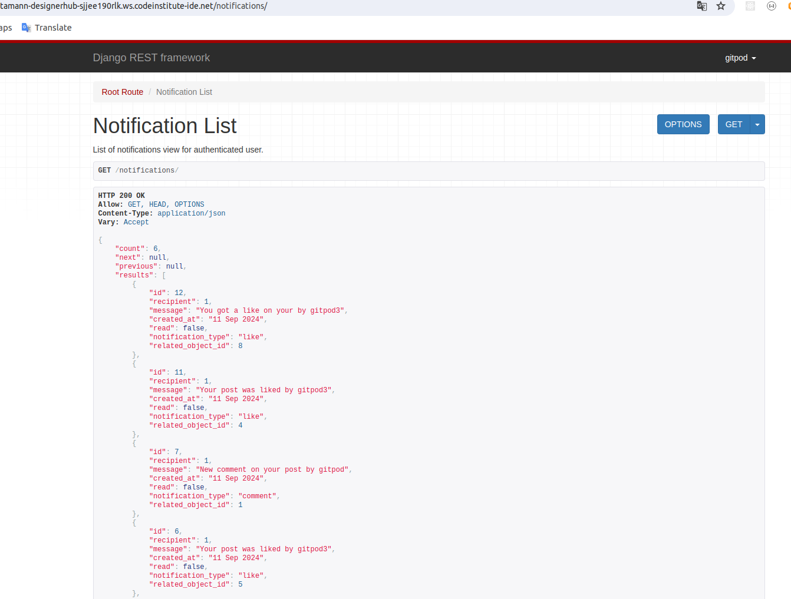
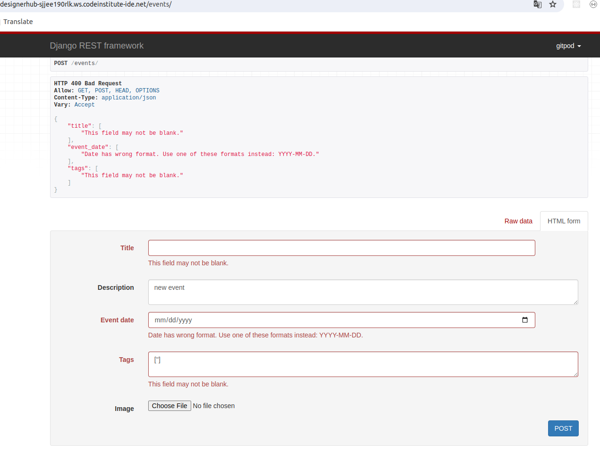

# Automated Test

## PostListViewTests 

Any user can see all post lists. Logged in user can create posts. Users that aren't logged in can't create posts.

## PostDetailViewTests

A post can be retrieved using valid ID. A post can't be retrieved using invalid ID. Logged in user can update his own post. Logged in user can not update another 
user's post.

## NotificationModelTests

Checks if the user gets notification based on likes, comments and followers. It tests string representation of notification
that includes recipients username, notification type and creation time. Notifications are also tested based on their ordering. They are ordered by
created_at.

## EventListViewTests

Any user can see all event lists. Logged in user can create events. Users that aren't logged in can't create events.

## EventDetailViewTests

An event can be retrieved using valid ID. An event can't be retrieved using invalid ID. Logged in user can update his event post. Logged in user can not update another user's event.

# Manual Tests

## Comments App

Logged out users can see comment list without the option of adding a new comment.

Logged in user can comment on a post.

User can not post an empty comment.

Comments can be retrived by valid id. It can be done by both logged in and logged out user.

If user is the owner of the comment he can edit or delete it by retrieving it. If user is not the owner of the comment he can not edit or delete it.

## Followers app

 Logged-out user can see a list of all followers and all instances of a user following another user. 

 

 Logged-in user can see a list of all followers and all instances of a user following another user as well as has the option to follow other user.

 

 If a logged-in user tries to follow the same user twice, the API should return an HTTP 400 Bad request error.

 

 A logged-in user should also be able to delete a follower instance retrieving by the id from Follower List.

 

 ## Like app

Logged out user can see the list of likes.

Logged-in user can see a list of likes and  has the option to like a post.

Likes can be retrieved by its Id. If author is the user he can delete this.

If a logged-in user tries to like the same post twice, the API should return an HTTP 400 Bad request error.

## Profile App

Profile list can be viewed by both logged in and logged out users.

If user is the owner he can edit his profile by retrieving the profile by ID.

An invalid ID will show 404 error message.

## Category App

Logged in user can make a post with selecting the catagory.

## Notifications App

Logged in user can see his notifications.

Logged out user can not see any notification.

## Events App

Logged out users can see event list without the option of adding a new event.

Logged-in user can see a list of events and  has the option to create an event.

Event can be retrieved by its ID and if the user is the author he can edit or delete it.

But if user is not the author he can not edit or delete it.

If user try to retrieve an event by wrong ID it will show HTTP 404 Not Found error.

If user tries to create an event without title, date and tag it will show error.

## Post App

Logged out users can see post list without the option of adding a new event.

Logged-in user can see a list of posts and  has the option to create a post.

Post can be retrieved by its ID and if the user is the author he can edit or delete it.

But if user is not the author he can not edit or delete it.

If user try to retrieve a post by wrong ID it will show HTTP 404 Not Found error.

If user tries to create a post without title it will show HTTP 400 Bad Request error.

